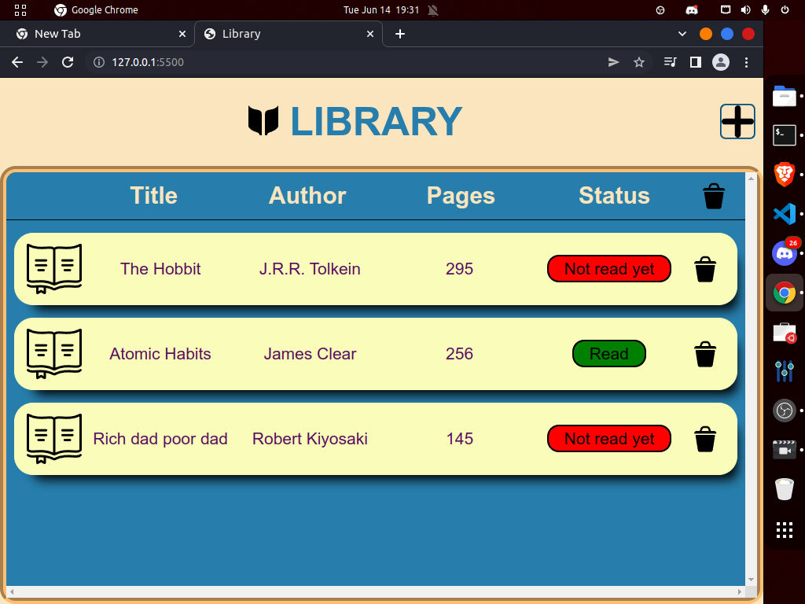

# Library Project

# What is Library Project
Library is one of the project on TheOdinroject. The objective of this project is practice the oop in js. Also put in all the previous learnings like grid, from, form validation, dom manupilation.

# What did I learn?
- How to create a constructor in js.
- How to create many objects with a constrcutor.
- How to create layout with grids
- How to use dom manupilation
- Differnet Grid properties
    - grid-template-column
    - grid-template-row
    - gap
    - Many more
- How to use different Css selectors
    - Simple selectors   
    - Combinator selectors 
    - Pseudo-class selectors
- How to use a color palette

# Link
https://muditchoudhary.github.io/library/

# Icons, Images, Svg Images, Color Pellate Credits
- Svg icons from [Svg Repo](https://www.svgrepo.com/)
- Color Scheme from [khorma.co](http://khroma.co/)
- Font from [Google fonts](https://fonts.google.com/)